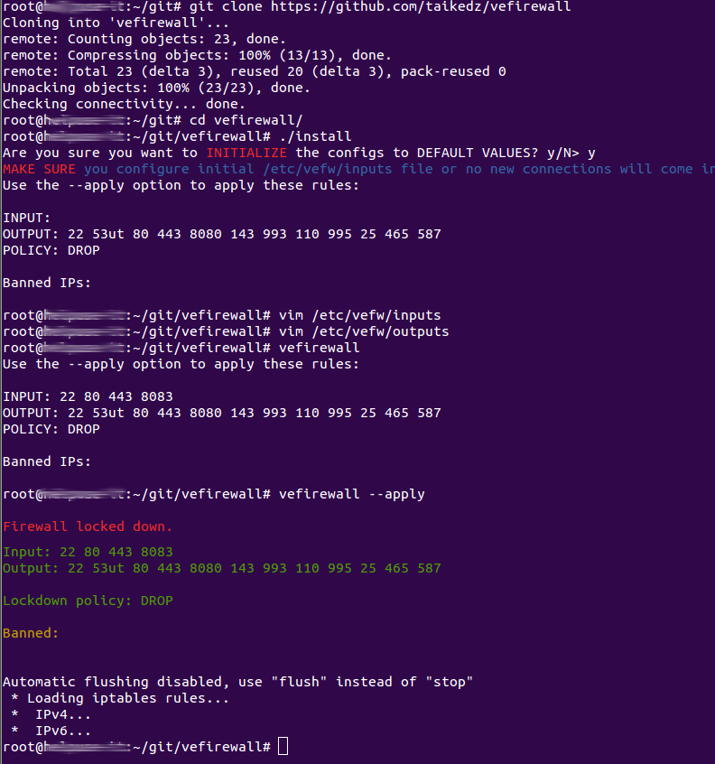

# Very Easy Firewall

Sometimes you need surgical precision. Sometimes you need a versatile swiss-army-knife.

And sometimes all you need is a hammer.

## What for

Very Easy Firewall is an extremely simple firewall setup tool that allows you to configure some simple firewall rules and apply them. You don't need to content with firewalld syntax, ufw usage, or iptables expertise.

You just need to know what ports to allow input on, what ports to allow output on, and what IPs you want to ban.

Simple.

(Of course, don't use this tool if you are using anything else to manage your firewall, like `fail2ban` or `snort`.)

## How to use it

There are four configuration files. Edit them as appropriate - see examples folder for an idea. They are really very simple.

* `/etc/vefw/inputs` - Specify a list of port numbers to let traffic out on
* `/etc/vefw/outputs` - Specify a list of port numbers to let traffic in on
* `/etc/vefw/policy` - Specify the policy - DROP or REJECT (or ACCEPT *if* you are testing!)
* `/etc/vefw/banned` - Specify IP addresses, IP ranges, and domain names you want to block traffic coming from

Finally, run `vefirewall` to see the rules ; run `vefirewall --apply` to apply them.

## Simple run-down

The Very Easy Firewall uses Linux `iptables` to control the firewall, and a set of configuration files

The default policy is set to DROP. All you need to do is add port specifications to the "inputs" and "outputs" files.

You also have a single file, listing banned IP addresses and IP ranges, and you can configure any program to simply write to the "banned" list to have them banned when next vefirewall is run.

The banning chain is the first rule loaded to INPUTS, before even letting "ESTABLISHED"/"RELATED" rules through.

## TODO

To-do list includes the following:

* Add support for profiles
	* sets of rules admins can switch between as required
* Add chain-level policy
	* allow the "inputs" and "outputs" files to specify their own policies
* Save iptables configurations without external tool
* Add non-interactive mode - for running in cron jobs.
* Allow use in conjunction with other firewall managers:
	* Add support for firewalld and ufw
	* Move rules to their own chains - vefwinput vefwoutput
		* allow chains to specify post- or pre- loading

